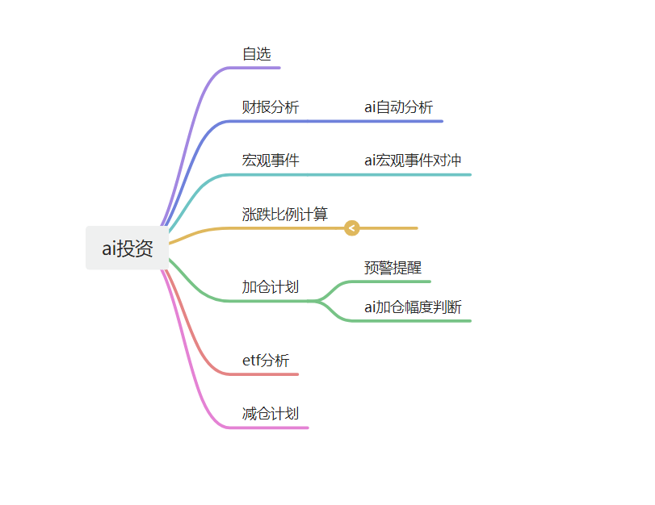
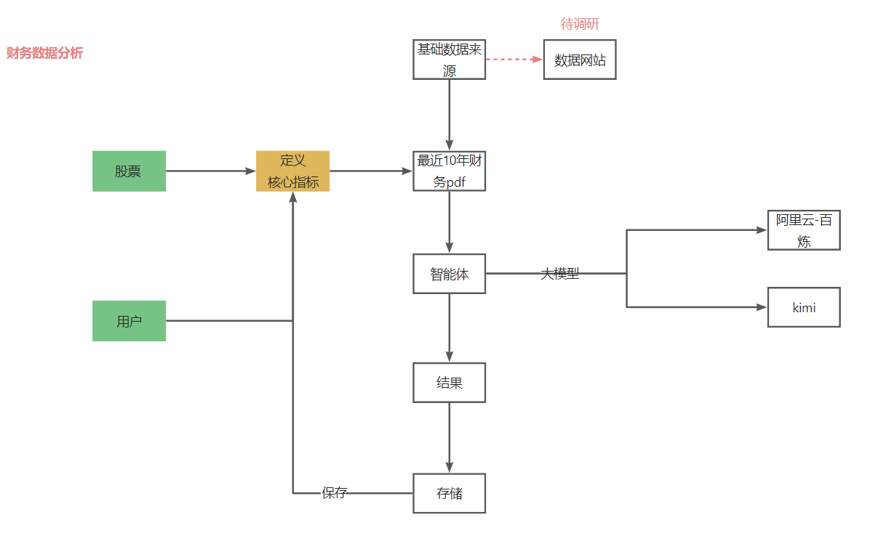
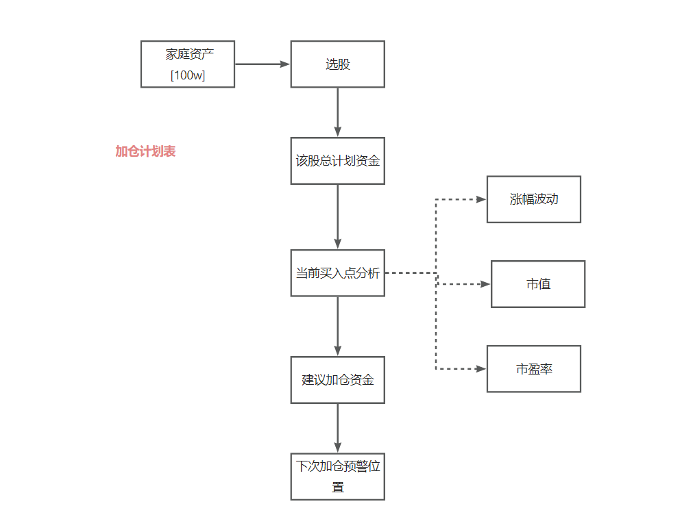

# ai投资

为中短期投资以及长线投资打造一站式工具；

## 读取财报 --- 对比

## 流程

* 对接大模型
* 训练数据
* 各种维度分析
* 出台分析报告

## 宏观政策时间点预测

## 业务

## 财报分析 智能体

* 使用阿里云百练 大模型。

## 加仓计划

* 准备对接AI 加仓计划设计::

## 减仓计划

## 宏观监控

## 国内宏观监控

* 政策时间
* 极端情况预估

## 国外宏观监控

