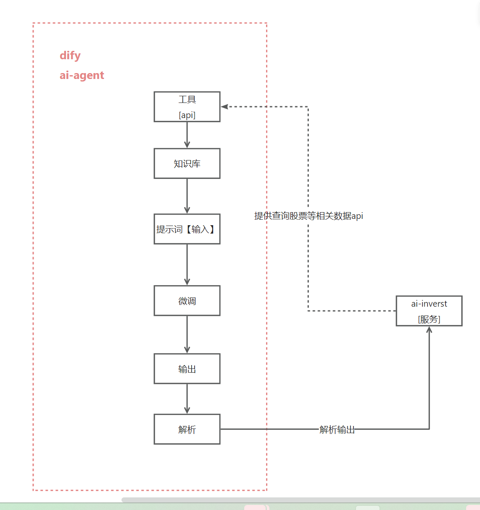

# ai-agent 方案
使用开源： https://github.com/langgenius/dify
1. 学习下
2. 更灵活

### 流程



### 实现点
1. 本地部署
2. 本地小模型/或者线上阿里云模型等 方便切换
3. invest服务提供相关数据接口api
4. 提示词设计
5. 输出解析

### dify本地docker不熟
https://docs.dify.ai/zh-hans/getting-started/install-self-hosted/docker-compose

### ollama 安装部署
* ollama 安装参考
* 修改模型存在的路径

```shell
PS D:\ljq> ollama
Usage:
  ollama [flags]
  ollama [command]

Available Commands:
  serve       Start ollama
  create      Create a model from a Modelfile
  show        Show information for a model
  run         Run a model
  stop        Stop a running model
  pull        Pull a model from a registry
  push        Push a model to a registry
  list        List models
  ps          List running models
  cp          Copy a model
  rm          Remove a model
  help        Help about any command
  
```
* 先拉取你想要的本地部署的模型
* 再本地启动
```shell
PS D:\ljq> ollama list
NAME              ID              SIZE      MODIFIED     
qwen2.5:latest    845dbda0ea48    4.7 GB    11 hours ago

PS D:\ljq> ollama run qwen2.5:latest


```
* 一般16G n卡，比如4060TI 可以部署7b左右的

## dify接入ollama本地部署的模型


